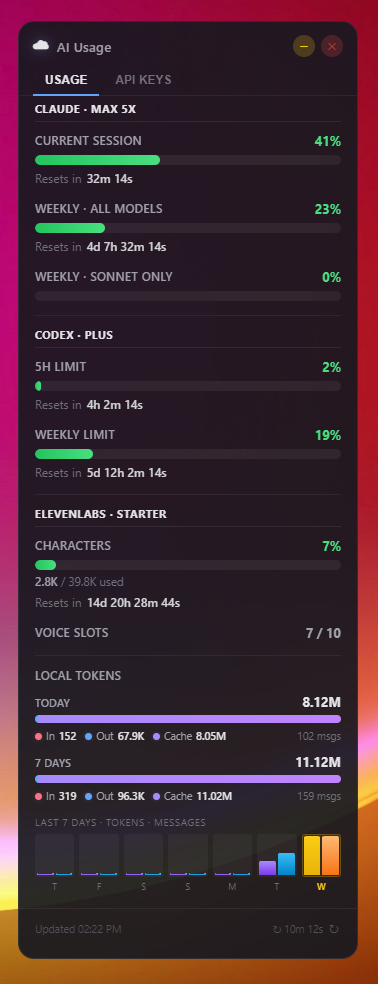
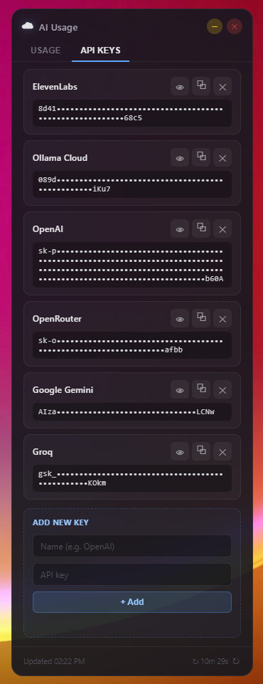
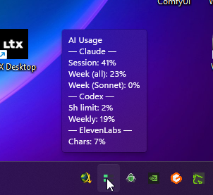

# AI Usage Widget

Tools that show your **Claude Code**, **OpenAI Codex** and **ElevenLabs** usage in real time — Claude's session %, weekly limits (all models + Sonnet only) and Extra Usage spend, Codex's 5-hour and weekly limits, and ElevenLabs' character + voice-slot consumption — with live countdowns to each reset.

- A **terminal dashboard** (`get_usage.js`) that renders directly in your shell.
- A **floating desktop widget** (Electron) that stays on top of your windows. Includes a **system tray icon** with two live bars (Claude session % on top, weekly % on bottom) and a tooltip/menu showing the exact numbers for every provider.
- An **API Keys tab** in the widget to view, copy, hide/show and add your own keys (stored locally in `config.json`).

Claude and Codex reuse the CLI sessions you already have logged in (no tokens to paste). ElevenLabs uses an API key you save once in `config.json` (or in the API Keys tab) — see `config.example.json`.

---

## Screenshots

**Terminal dashboard (`node get_usage.js`)**


**Floating desktop widget — Usage tab (`npm start`)**



**API Keys tab — view, copy, hide/show and add keys**



**System tray icon with live bars and tooltip**



The tray icon sits next to the clock and draws two horizontal bars — Claude's session % on top and weekly % on bottom — so you can see your usage at a glance without opening the widget. Hovering (or right-clicking) shows the full breakdown for every provider: Claude session and weekly limits, Codex 5-hour / weekly, and ElevenLabs character usage.

---

## How it works (the simple version)

1. You already log in to Claude Code once with `claude`, and/or to Codex once with `codex`, in a terminal.
2. These tools spawn each CLI in a pseudo-terminal (via `node-pty`), type `/usage` (Claude) or `/status` (Codex), capture the rendered screen, and parse out the numbers.
3. Data is refreshed every N minutes (default 15, configurable — see below). Countdowns tick every second locally and force an immediate refresh the moment any of them reaches zero.

That's it — no scraping of APIs, no tokens handled by the app. If you can run `claude` and/or `codex` in your terminal, these tools work.

### Configuration

Copy `config.example.json` to `config.json` and edit it:

```json
{
  "refreshMinutes": 15,
  "elevenLabsApiKey": "",
  "apiKeys": []
}
```

- `refreshMinutes` — how often to re-fetch usage (default 15).
- `elevenLabsApiKey` — optional; without it the ElevenLabs panel is skipped. Can also be supplied via the `ELEVENLABS_API_KEY` env var, or saved through the **API Keys** tab in the widget.
- `apiKeys` — list of `{name, key}` entries, managed from the widget's **API Keys** tab. Useful to keep your own provider keys handy (with copy/show buttons).

`config.json` is git-ignored so your keys stay local. Both the terminal script and the widget read this file at startup; restart after changing it.

---

## Setup

### 1. Install and log in to Claude Code (one time)

Install Claude Code following the official docs: https://docs.claude.com/claude-code

Then open a terminal and run:

```bash
claude
```

Complete the login flow. From this point on, the widget and the script work on their own — **you never need to log in again or paste any token into this project**.

### 2. Clone and install

```bash
git clone https://github.com/<your-user>/CC_usage_widget.git
cd CC_usage_widget
npm install
```

> Requires Node.js 18+. See [REQUIREMENTS.md](REQUIREMENTS.md) for details (including native-build toolchain notes for `node-pty`, if needed).

### 3a. Run the terminal dashboard

```bash
node get_usage.js
```

You'll see the ANSI dashboard above. `Ctrl+C` to exit.

### 3b. Run the floating desktop widget

```bash
npm start
```

An always-on-top frameless window appears in the top-right corner of your primary display, plus a tray icon next to the clock. The tray icon draws two horizontal bars (session % and weekly %), and the tooltip/right-click menu shows the exact numbers. Closing the widget window hides it to tray — use the tray's **Quit** entry to fully exit.

---

## Project layout

| File                  | Purpose                                                                           |
| --------------------- | --------------------------------------------------------------------------------- |
| `get_usage.js`        | Standalone terminal dashboard.                                                    |
| `fetcher.js`          | One-shot fetcher — runs `claude /usage` and prints JSON.                          |
| `codexFetcher.js`     | One-shot fetcher — runs `codex /status` and prints JSON.                          |
| `elevenLabsFetcher.js`| One-shot fetcher — calls `https://api.elevenlabs.io/v1/user/subscription`.        |
| `main.js`             | Electron main process; spawns the fetchers on a timer and auto-resizes the window.|
| `preload.js`          | Electron preload bridging IPC to the renderer.                                    |
| `renderer.js`         | Widget UI logic (Usage + API Keys tabs).                                          |
| `index.html`          | Widget markup.                                                                    |
| `styles.css`          | Widget styles.                                                                    |
| `config.example.json` | Sample config to copy as `config.json`.                                           |

---

## Notes / caveats

- Each refresh spawns `claude` for ~20–25 seconds in the background to capture the `/usage` screen. This is intentional and cheap, but you'll see a short-lived child process appear.
- The parser matches the current English `/usage` layout. If Anthropic changes the screen, the regexes in `fetcher.js` / `get_usage.js` may need a small update.
- Countdowns are computed against `America/Buenos_Aires` (UTC−3), matching where `/usage` reports resets. Tweak `parseResetDate()` if you need a different zone.

## License

MIT
